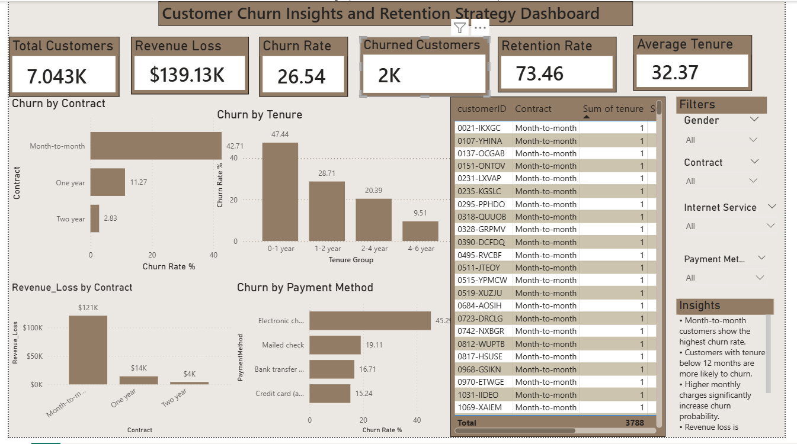

# Customer Churn Analysis and Retention Strategy using SQL and Power BI

## Project Overview
Analyzed customer churn patterns using SQL, Excel, and Power BI to identify high-risk customers, revenue loss, and retention opportunities.

## Dashboard Preview

---

## Business Problem
Customer churn directly affects business revenue and long-term growth. This project focuses on identifying churn drivers and recommending retention strategies to reduce customer loss.

---

## Tools & Technologies
- SQL
- Power BI
- Advanced Excel
- KPI Analysis
- Data Visualization

---

## Key KPIs
- Churn Rate
- Retention Rate
- Revenue Loss
- Average Customer Tenure
- High-Risk Customers

---

## Dashboard Features
- KPI Cards
- Churn Analysis by Contract Type
- Revenue Loss Analysis
- Customer Segmentation
- Interactive Filters & Slicers
- Customer Risk Identification

---

## Key Insights
- Month-to-month contract customers showed the highest churn risk
- Customers with higher monthly charges had increased churn probability
- Short-tenure customers were more likely to leave
- Long-term contracts improved customer retention
- Revenue loss was concentrated among high-risk customer groups

---

## Business Challenges
- High churn among new customers
- Weak customer onboarding process
- Lack of long-term contract incentives
- Revenue impact due to customer loss

---

## Business Recommendations
- Offer discounts for yearly contracts
- Improve onboarding for new customers
- Create targeted retention campaigns
- Introduce loyalty benefits for long-term customers
- Reduce churn among high-risk segments

---

## Business Impact
This analysis helps organizations identify churn drivers, reduce customer loss, and improve customer retention using data-driven decision-making.

---

## Project Outcome
Delivered actionable churn insights through SQL analysis and Power BI dashboards to support customer retention and strategic business decision-making.
